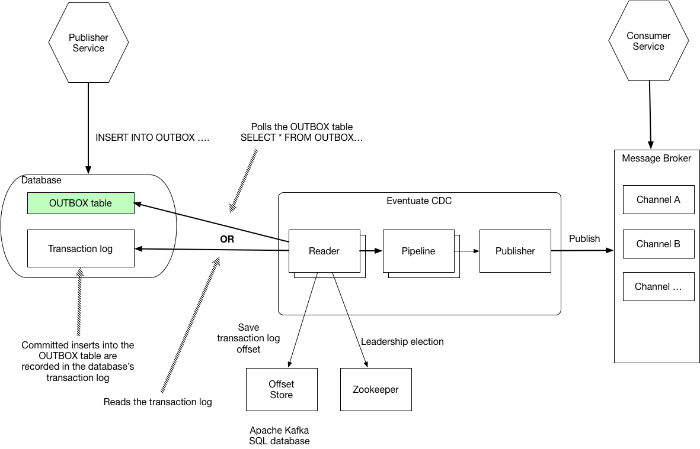

[[cdc-configuration]]
= Configuring the Eventuate CDC Service

This section describes how to configure the Eventuate CDC service (Eventuate Local 0.30.X, Eventuate Tram 0.20.X).

== Introduction to the CDC service

The Eventuate CDC service is responsible reading the events/messages inserted into a https://microservices.io/patterns/data/application-events.html[Transactional `OUTBOX` table] and publishing them to the message broker.
The following diagram shows the architecture.

The key parts are as follows:

* Publisher service - the service that inserts a message/event into an OUTBOX table
* Consumer service - the service that consumes the message/event
* OUTBOX table - The EVENTS table for Eventuate Local application and the  MESSAGE table for en Eventuate Tram application
* Eventuate CDC service - the service that publishes messages/events to message broker
* Reader - a component of the CDC that retrieves inserted messages events using either transaction log tailing or polling using a `SELECT` statement
* Pipeline - invoked by the reader to publish the message
* Offset Store - used by the reader to record the current transaction log offset, e.g. MySQL binlog
* Publisher - used by the pipeline to publish the message/event to the message broker
* Zookeeper - used by the reader for leadership election when clustered

The Eventuate CDC service is a Spring Boot application.

=== Supported databases

Eventuate CDC supports the following databases:

* MySQL
* Postgres
* Microsoft SQL server

It can also support other databases that have a JDBC driver, although the CDC service would need to be rebuilt with the driver.

=== Supported message brokers

Eventuate CDC supports the following message brokers

* Apache Kafka - Eventuate Local and Eventuate Tram
* Apache ActiveMQ - Eventuate Tram only
* RabbitMQ - Eventuate Tram only
* Redis - Eventuate Tram only

=== Docker images

The Eventuate CDC service is conveniently packaged as a Docker image.
The latest version is

image::https://img.shields.io/maven-central/v/io.eventuate.cdc/eventuate-cdc-service[link="https://search.maven.org/artifact/io.eventuate.cdc/eventuate-cdc-service"]

[cols=2, options="header"]
|===

| Image
| Description

| eventuateio/eventuate-cdc-service:LATEST_VERSION
| Eventuate Tram + Eventuate Local

|===

== How it works

To use the Eventuate CDC service, you configure one or more readers and pipelines and a publisher

* Reader - reads events/messages inserted into the database by either https://microservices.io/patterns/data/transaction-log-tailing.html[tailing the transaction log] or https://microservices.io/patterns/data/polling-publisher.html[polling using queries]
* Pipeline - transforms the inserted message/event into a message to publish to a message broker destination (topic, queue, exchange etc)
* Publisher - invoked by the pipeline to publish the message to the message broker

=== About Readers

A reader retrieves each message/event inserted into the database and invokes the pipeline that’s interested in that message/event.

==== Strategies for reading messages/events

A CDC reader reads messages/events using one of the following mechanisms:

* MySQL - transaction log tailing using the MySql binlog protocol
* Postgres - transaction log tailing using Postgres WAL
* Generic JDBC - polling the `OUTBOX` table by periodically executing a SQL `SELECT` statement to retrieve messages and an `UPDATE` statement to mark them as having been read.

==== MySQL binlog current offset storage

The MySQ binlog reader records its current position (file, offset) in the MySql binlog in an offset store.
There are two types of offset store depending on which message broker is being used:

* Apache Kafka topic - when using Apache Kafka
* Database table -  when a message broker other than Apache Kafka

The offset is stored using a key value of `reader.offsetStoreKey` property (or name of the reader is used if property is not specified explicitly), which enables multiple readers to use the same store.

==== CDC Leadership election

When running a cluster of Eventuate CDC services, a reader uses a Zookeeper-based leadership election to determine which reader is active.
When cdc is configured to use Redis message broker (`spring.profiles.active=Redis`), Redis is used instead of Zookeeper for leadership.

=== About Pipelines

A pipeline, which is invoked by a reader, transforms the inserted message/event into a message to publish to a message broker destination (topic, queue, exchange etc).
There are two types of pipelines:

* Eventuate Local
** Processes events inserted into an EVENTS table
** An event’s aggregate type determines which message broker channel the event is published to
* Eventuate
** Processes messages inserted into an MESSAGE table
** The row’s DESTINATION column specifies the message broker channel the message is published to

=== About Publishers

A publisher is invoked by the pipeline and publishes the message/event to a message broker destination.
There are three types of publishers:

* Apache Kafka
* Apache ActiveMQ
* RabbitMQ
* Redis

== Configuring the Eventuate CDC service

The Eventuate CDC is configured using https://docs.spring.io/spring-boot/docs/current/reference/htmlsingle/#boot-features-external-config[Spring Boot-style properties].
You can, for example, configure an Eventuate CDC service that is deployed as a container by setting the container's environment variables.

There are two styles of configuration:

* Single pipeline - this is intended for simple scenarios and to simplify upgrading from previous versions
* Multi pipeline - allows the configuration of multiple pipelines, such as when each service has its OUTBOX table, or when an application uses both Eventuate Local and Eventuate Tram

=== Single pipeline configuration

This style of configuration is almost identical to how previous versions of the CDC were configured.
It creates a single reader and pipeline.

Reader:

* The default reader type is MySQL binlog
* Enable Postgres WAL by `spring.profile.active=PostgresWal`
* Enable polling by `spring.profile.active=EventuatePolling`

Pipeline:

* The pipeline type is determined by `eventuate.cdc.type` property
   * `eventuate.cdc.type=EventuateLocal` - Eventuate Local pipeline
   * `eventuate.cdc.type=EventuateTram` - Eventuate Tram pipeline (used by default when property is not specified)

Publishing:

* Eventuate Local CDC service - Apache Kafka only
* Eventuate Tram CDC service - The default is Apache Kafka but you can use Apache ActiveMQ, RabbitMQ, Redis by activating the appropriate profile (described below).

There are two sets of properties, one for the reader and another for the pipeline.

==== ID generation (THIS NEEDS TO MOVE SOMEWHERE ELSE)

Each event/message has a 128-bit ID.
Eventuate event/message IDs must be

* Unique
* Monotonic - constantly increasing, e.g. a consumer can detect duplicate events by comparing with the ID of last processed event from a given aggregate

Eventuate support two ID generation strategies:

* Application-generated ID - the producer generates the ID
* Database-generated IDs - the database generates the ID, e.g. using auto-incrementing columns

Let's look at each approach.

===== Application-generated ID

This is the default strategy.
IDs are generated by publisher (Eventuate Local/Tram).
An application-generated ID consists of the following parts:

* 64 bits - the current time in milliseconds
* 16 bits - counter within milliseconds
* 48 bits - MAC address

The Application ID generation strategy is simple.
But it has some drawbacks.
The first drawback is that it relies on clocks being unsynchronized.

Imagine the following scenario where entity X is updated twice:

1. Entity X updated on server N at time T1 => event ID T1
2. Entity X updated on server M at time T2 => event ID T2

If the clocks are not synchronized, it's possible that T2 < T1, which violates the requirement for monotonic IDs.

The second drawback is that multiple instances services are running on the same machine then by default they use the same MAC address, which results in non-unique IDs.

===== Database-generated IDs

The second and recommended strategy is database-generated IDs.
This stategy uses database auto-generated IDs, e.g. MySQL auto-incrementing primary keys, or Postgres bigserial types.

A database generated ID has the following structure:

* 64 bits - DB generated ID, ie. an auto-incrementing column of the outbox (`MESSAGE`/`EVENTS`) table
* 16 bits - counter, used for internal needs, usually zero
* 48 bits - a unique Eventuate outbox ID that identifies the outbox table

As you can see, a message ID is a combination of the primary key of the outbox table and the table's Eventuate outbox ID.
The Eventuate Outbox ID must be globally unique (within your application).
You must configure all producers that insert messages/events into a given outbox table and the CDC reader that reads from that outbox with the same Eventuate outbox ID.

There are three parts to using database-generated IDs:

* Database schema
* Message Producer configuration
* CDC configuration

===== Database schema for database-generated IDs

This ID generation algorithm changes the database schema by using auto-generated primary keys for the `EVENTS` and `MESSAGE` tables:

* `EVENTS` table - `ID` column
* `MESSAGE` table - `DBID` column

Eventuate database Docker images since eventuate-common 0.13.0.RELEASE support this schema.

You can activate database-generated ID support by setting `USE_DB_ID` to "true":

----
  mysql:
    image: eventuateio/eventuate-mysql:$EVENTUATE_COMMON_VERSION
    ports:
      - 3306:3306
    environment:
      - MYSQL_ROOT_PASSWORD=rootpassword
      - MYSQL_USER=mysqluser
      - MYSQL_PASSWORD=mysqlpw
      - USE_DB_ID="true"
----

You can migrate an existing database by using one of the following migration scripts:

* link: https://github.com/eventuate-foundation/eventuate-common/blob/master/mysql/4.initialize-database-db-id.sql[MySQL]
* link: https://github.com/eventuate-foundation/eventuate-common/blob/master/mariadb/4.initialize-database-db-id.sql[MariaDB]
* link: https://github.com/eventuate-foundation/eventuate-common/blob/master/postgres/5.initialize-database-db-id.sql[Postgres]
* link: https://github.com/eventuate-foundation/eventuate-common/blob/master/mssql/4.setup-db-id.sql[MS SQL Server]

PLEASE NOTE: Please shutdown your application before migrating the schema.

===== Configurating the message producer

You must configure the producer with an Eventuate outbox ID:

Spring:

----
eventuate.outbox.id=1
----

Micronaut:

----
eventuate:
    outbox:
        id: 1
----

===== Configurating the CDC

You must also configure the CDC reader with the Eventuate outbox ID.

==== Single pipeline - Reader Properties

[cols=4, options="header"]
|===
| property | Description | Default value | Reader property name

| spring.datasource.url | JDBC connection url | - | dataSourceUrl
| spring.datasource.username | Username to use for the connection | - | dataSourceUserName
| spring.datasource.password | Password to use for the connection | - | dataSourcePassword

| spring.datasource.driver.class.name
| Jdbc driver class name
| -
| dataSourceDriverClassName

| eventuatelocal.cdc.leadership.lock.path
| Zookeeper node path used for the leadership election. Only one reader with the same properties is allowed at the moment. To achieve that the zookeeper leadership recipe is used.
When Redis is used as message broker, it also used for leadership election. In that case the same property used as Redis key.
| `/eventuatelocal/cdc/leader/1`
| leadershipLockPath

| eventuatelocal.cdc.offset.store.key
| Used for the mysql binlog profile as key to store the current offset in the offset store.
| value of the reader name
| offsetStoreKey

| eventuatelocal.cdc.reader.name
| The name of the reader. If eventuatelocal.cdc.offset.store.key is not specified, it is used by the mysql binlog reader as the key to store the current offset in the offset store
| -
| -

| eventuatelocal.cdc.offset.storage.topic.name
| (mysql-binlog)

Apache Kafka topic that stores the current binlog offset.
| `offset.storage.topic`
| offsetStorageTopicName

| eventuatelocal.cdc.binlog.connection.timeout.in.milliseconds
| (mysql-binlog, postgres-wal only)

If the CDC cannot connect to the database, it will retry after the specified timeout.
| 5000
| binlogConnectionTimeoutInMilliseconds

| eventuatelocal.cdc.max.attempts.for.binlog.connection
| (mysql-binlog, postgres-wal only)

The number of connection attempts that the CDC service will make.
| 100
| maxAttemptsForBinlogConnection

| eventuatelocal.cdc.db.user.name
| (mysql-binlog only)

The  MySQL reader uses the separate user name with administrator privileges to read events from database. Usually ‘root’.
| -
| cdcDbUserName

| eventuatelocal.cdc.db.password
| (mysql-binlog only)

Password of the MYSQL reader user.
| -
| cdcDbPassword

| eventuatelocal.cdc.mysql.binlog.client.unique.id
| (mysql-binlog only)

Unique identifier across whole replication group.
| -
| mySqlBinlogClientUniqueId

| eventuatelocal.cdc.read.old.debezium.db.offset.storage.topic
| (mysql-binlog only)

Boolean flag, set it to "true" to start read records from the old debezium kafka topic, set it to "false" to start read records from the new cdc kafka topic.
| -
| ReadOldDebeziumDbOffsetStorageTopic

| eventuatelocal.cdc.polling.interval.in.milliseconds
| (polling only)

Sleep time between polling queries
| 500
| pollingIntervalInMilliseconds

| eventuatelocal.cdc.max.events.per.polling
| (polling only)

Event count requested by each polling query
| 1000
| maxEventsPerPolling

| eventuatelocal.cdc.max.attempts.for.polling
| (polling only)

If polling fails, reader will try again, but not more than specified times.
| 100
| maxAttemptsForPolling

| eventuatelocal.cdc.polling.retry.interval.in.milleseconds
| (polling only)

If polling fails, reader will try again using the specified interval.
| 500
| pollingRetryIntervalInMilliseconds

| eventuate.outbox.id
| Unique number (unsigned 48 bit) that used for event/message id generation when event/message id is missed (No application id generated).

| -
| outboxId

|===

==== Single pipeline - Pipeline Properties

[cols=4, options="header"]
|===
| property
| Description
| Default value
| Pipeline property name

| eventuate.database.schema
| Schema which is listened by the CDC service
| eventuate
| eventuateDatabaseSchema

| eventuatelocal.cdc.source.table.name
| Name of the table to read events/messages from
| Depends on the pipeline type.

`EVENTS` (eventuate-local) or `MESSAGE` (eventuate-tram).
| sourceTableName

|===

=== Multi-pipeline configuration

The new style configuration supports multiple readers and pipelines.
You can, for example, have a single CDC service,  which supports both Eventuate Local and Eventuate Tram services.
See, for example, https://github.com/microservices-patterns/ftgo-application/[FTGO application].

==== Configuring a reader

A reader is defined using Spring framework properties that obey the following naming convention: `eventuate.cdc.reader.<reader name>.<property name>`.
For example, you can configure a reader called `READER1` using environment variables such as these:

----
EVENTUATE_CDC_READER_READER1_TYPE: mysql-binlog
EVENTUATE_CDC_READER_READER1_DATASOURCEURL: jdbc:mysql://${DOCKER_HOST_IP}:3306/eventuate
EVENTUATE_CDC_READER_READER1_DATASOURCEUSERNAME: mysqluser
...
----

A reader has the properties shown in the following table.

[cols=3, options="header"]
|===
| Name | Description | Default Value

| type
| Type of the reading mechanism. Supported types are `mysql-binlog`, `polling`, and `postgres-wal`.
| -

| dataSourceUrl
| JDBC connection url
| -

| dataSourceUserName
| Username to use for the connection
| -

| dataSourcePassword
| Password to use for the connection
| -

| dataSourceDriverClassName
| Jdbc driver class name
| -

| leadershipLockPath
| Zookeeper node path used for the leadership election. The Zookeeper leadership recipe is used to select a leader. Example value: `/eventuatelocal/cdc/leader/1`
When Redis is used as message broker, it also used for leadership election. In that case the same property used as Redis key.
| -

| offsetStorageTopicName
| (mysql-binlog)

Apache Kafka topic used to store the current reader offset
| `offset.storage.topic`

| binlogConnectionTimeoutInMilliseconds
| (mysql-binlog, postgres-wal only)

If connection to the database failed, cdc service will try to connect again after the specified timeout.
| 5000

| maxAttemptsForBinlogConnection
| (mysql-binlog, postgres-wal only)

If connection to the database failed, cdc service will try to connect again but not more than specified times.
| 100

| cdcDbUserName
| (mysql-binlog only)

The  MySQL reader uses the separate user name with administrator privileges to read events from database. Usually ‘root’.
| -

| cdcDbPassword
| (mysql-binlog only)

Password of the MYSQL reader user.
| -

| mySqlBinlogClientUniqueId
| (mysql-binlog only)

Unique identifier across whole replication group.
| -

| readOldDebeziumDbOffsetStorageTopic
| (mysql-binlog only).

Boolean flag, set it to "true" to start read records from the old debezium kafka topic, set it to "false" to start read records from the new cdc kafka topic.
| -

| postgresWalIntervalInMilliseconds
| (postgres-wal only)

Specifies the time interval between status packets sent back to Postgres.
A value of zero disables the periodic status updates completely, although an update will still be sent when requested by the Postgres, to avoid timeout disconnect.
| 10

| postgresReplicationStatusIntervalInMilliseconds
| (postgres-wal only)

Time to sleep when events are not received.
| 1000

| postgresReplicationSlotName
| (postgres-wal only)

Name of the replication slot used to read events/messages.
| `eventuate_slot`

| pollingIntervalInMilliseconds
| (polling only)

Sleep time between polling queries
| 500

| maxEventsPerPolling
| (polling only)

Event count requested by each polling query
| 1000

| maxAttemptsForPolling
| (polling only)

If polling fails, reader will try again, but not more than specified times.
| 100

| pollingRetryIntervalInMilliseconds
| (polling only)

If polling fails, reader will try again using the specified interval.
| 500

| outboxId
| Unique number (unsigned 48 bit) that used for event/message id generation when event/message id is missed (No application id generated).

| -

|===

==== Configuring a pipeline

A pipeline is configured using Spring framework properties that obey the following naming convention: `eventuate.cdc.pipeline.<pipeline name>.<property name>`.
For example, you can configure a pipeline called `PIPELINE1` using environment variables such as these:

----
EVENTUATE_CDC_PIPELINE_PIPELINE1_TYPE: eventuate-local
EVENTUATE_CDC_PIPELINE_PIPELINE1_READER: reader1
...
----

A pipeline has the properties shown in the following table.

[cols=3, options="header"]
|===
| Name
| Description
| Default Value

| type
| Type of a pipeline.

The Eventuate Local CDC only supports `eventuate-local`.

The Eventuate Tram CDC supports `eventuate-tram` and `eventuate-local`
| -

| eventuateDatabaseSchema
| The schema of the transaction outbox table
| `eventuate`

| sourceTableName
| Name of the transactional outbox table
| Depends on the pipeline type.

`events` (eventuate-local) or `message` (eventuate-tram).

| reader
| Name of the reader.
| -

|===

=== Configuring the publisher

The publisher is invoked by the pipeline to publish a message/event to the message broker.
The Eventuate Local CDC service only supports Apache Kafka, since it relies on Kafka’s message retention capability.
By default, the Eventuate Tram CDC service publishes messages to Apache Kafka.
But it also supports Apache ActiveMQ, RabbitMQ, and Redis.

==== Apache Kafka

[cols=3, options="header"]
|===
| Name
| Description
| Default Value

| eventuatelocal.kafka.bootstrap.servers
| comma-separated list of host and port pairs
| -

| eventuate.cdc.kafka.enable.batch.processing
| enables sending multiple Eventuate Local events and Eventuate Tram messages inside singe Apache Kafka message.
| false

| eventuate.cdc.kafka.batch.processing.max.batch.size
| max size of multi-message Apache Kafka record in message.
| 1000000
|===

===== Apache Kafka Consumer Properties

The Eventuate CDC uses an Apache Kafka Consumer to read the current offset from the Apache Kafka-based offset store topic.
The currently configured consumer properties are as follows:

[cols=2, options="header"]
|===

| Name
| Value

| auto.offset.reset
| earliest

| group.id
| Random UUID

| enable.auto.commit
| false

| auto.commit.interval.ms
| 1000

| session.timeout.ms
| 30000

| key.deserializer
| org.apache.kafka.common.serialization.StringDeserializer

| value.deserializer
| org.apache.kafka.common.serialization.StringDeserializer
|===

You can override these properties and supply other Apache Kafka Consumer properties by defining properties prefixed with `eventuate.local.kafka.consumer.properties`.

===== Apache Kafka Producer Properties

The Eventuate CDC uses an Apache Kafka producer to publish messages/events to Apache Kafka and to record the current offset in the Apache Kafka-based offset store topic.
The currently configured producer properties are as follows.

[cols=2, options="header"]
|===

| Name
| Default Value

| acks
| all

| retries
| 0

| batch.size
| 16384

| linger.ms
| 1

| buffer.memory
| 33554432

| key.serializer
| org.apache.kafka.common.serialization.StringDeserializer

| value.serializer
| org.apache.kafka.common.serialization.StringDeserializer

|===

You can override these properties and supply other Apache Kafka Producer properties by defining properties prefixed with `eventuate.local.kafka.producer.properties`.

==== Apache ActiveMQ

To publish messages to Apache ActiveMQ, please enable the `ActiveMQ` Spring profile using `spring.profiles.active=ActiveMQ`.

[cols=3, options="header"]
|===
| Name
| Description
| Default Value

| activemq.url
| Url of the activemq server.

Format: <protocol>://<ip>:<port>

Example: tcp://172.17.0.1:61616
| -

| activemq.user
| user used for authorization in the activemq
| -

| activemq.password
| password used for authorization in the activemq
| -

|===

==== RabbitMQ

To publish messages to RabbitMQ, please enable the `RabbitMQ` Spring profile using `spring.profiles.active=RabbitMQ`.

[cols=3, options="header"]
|===

| Name
| Description
| Default Value

| rabbitmq.broker.addresses
| Coma separated hosts with optional ports of the RabbitMQ servers.
Example: 172.17.0.1,172.17.0.1:6000
| -

| eventuate.rabbitmq.partition.count
| Number of partitions. Messages are split between partitions similar to Apache Kafka.
Partition is selected depending on message key hash. Processing of messages with the same partitions are ordered.
| 2

|===

==== Redis

To publish messages to Redis, please enable the `Redis` Spring profile using `spring.profiles.active=Redis`.

[cols=3, options="header"]
|===

| Name
| Description
| Default Value

| eventuate.redis.servers
| Redis hosts and ports separated by commas
Example: 172.17.0.1:6379,172.17.0.1:6380
| -

| eventuate.redis.partitions
| Number of partitions. Messages are split between partitions similar to Apache Kafka.
Partition is selected depending on message key hash. Processing of messages with the same partitions are ordered.
| -

|===

// TODO Document the use of the hash exchange plugin - Should this be optional?

=== Other configuration

The Eventuate CDC service also has the following configuration properties.

[cols=3, options="header"]
|===

| Name
| Description
| Default value

| eventuatelocal.cdc.max.event.interval.to.assume.reader.healthy
| The number of milliseconds within which an event must be received in order for a MySQL binlog/Postgres WAL-based reader to be considered healthy
| 60000

|===

TODO: This should probably be replaced with N x reader.replicationLagMeasuringIntervalInMilliseconds

== Configuring infrastructure services

The CDC service requires various infrastructure services including:

* Relational database, such as MySQL or Postgres
* Message broker, such as Apache Kafka

=== CDC Database schema

The Eventuate CDC service requires several tables.
The Eventuate MySQL and Postgres images define these tables.

==== `CDC_MONITORING` table

The CDC service uses the `CDC_MONITORING` table to implement a 'heart beat' mechanism.
Each reader that uses transaction log tailing (MySQL binlog/Postgres WAL) periodically updates a row in this table and measures the delay in receiving the update from the transaction log.

==== `OFFSET_STORE` table

When publishing messages to Apache ActiveMQ, RabbitMQ, Redis, the MySql binlog reader records the current binlog position in this table.

=== Apache Kafka broker configuration

The MySQL binlog reader records the current binlog position in the `offsetStorageTopicName` topic.
This topic should have the following configuration:

* Compacted topic with a relatively short retention time
* Replication factor of 3

== CDC service observability

The Eventuate CDC service has several features that enable monitoring in a production environment.

=== Health Check endpoint

The Eventuate CDC service has a standard https://microservices.io/patterns/observability/health-check-api.html[Spring Boot health check endpoint] `<eventuate-local-base-url>/actuator/health`.
It reports on the health of the following:

* Apache Zookeeper - verifies that the CDC service can connect to Apache Zookeeper
* Apache Kafka - verifies that the CDC service can connect to Apache Kafka
* CDC readers - the health of a reader is determined as follows:
** A reader is always healthy when it is not leader
** A reader that is the leader is unhealthy when one of the following is true:
*** It is not connected to the database (PostgresWal, MySqlBinlog only)
*** It did not receive events recently as defined by the `eventuatelocal.cdc.max.event.interval.to.assume.reader.healthy` property, which defaults to 60 seconds. (PostgresWal, MySqlBinlog only)
* Publisher - is unhealthy when the last attempt at publishing the message failed.

=== Metrics

The Eventuate CDC service publishes the https://microservices.io/patterns/observability/application-metrics.html[standard Spring Boot/Prometheus metrics] via the following endpoint `<eventuate-local-base-url>/actuator/prometheus`.

[cols=3, options="header"]
|===

| Name
| Type
| Description

| eventuate.cdc.messages.processed
| Counter
| Count of the processed events (inserts/updates into cdc the related tables).

| eventuate.cdc.binlog.entries.processed
| Counter
| Count of the Inserts/Updates into the all tables.
(PostgresWal, MySqlBinlog only)

| eventuate.cdc.leader
| Gauge
| 1 If binlog entry reader is leader, 0 otherwise

| eventuate.cdc.connection.attempts
| Counter
| Each time when reader reconnects to database it is increased by 1. (PostgresWal, MySqlBinlog only)

| eventuate.cdc.replication.lag
| Gauge (should be replaced by DistributionSummary)
| Time in milliseconds between event is inserted into table and read by the binlog entry reader. (PostgresWal, MySqlBinlog only)

| eventuate.cdc.replication.lag.age
| Gauge
| Time in milliseconds since the last lag measurement.
(PostgresWal, MySqlBinlog only)

| eventuate.cdc.connected.to.database
| Gauge
| 1 if reader is connected to database. 0 otherwise. (PostgresWal, MySqlBinlog only)

| eventuate.cdc.event.age
| Gauge
| Shows time in milliseconds between event created and published.

| eventuate.cdc.events.published
| Counter
| Indicates how many events were published to message broker.

| eventuate.cdc.events.duplicates
| Counter.
| Indicates how many event duplicates were found.

| eventuate.cdc.events.retries
| Counter.
| Increased by 1 when message publishing is failed and retried.

|===

==  Upgrading to the Eventuate CDC from older versions of the CDC (pre-Eventuate Local 0.30.X, pre-Eventuate Tram 0.20.X)

The configuration properties of the Eventuate CDC are different than older versions of the CDC.
When upgrading, you need to specify configuration properties that correctly correspond to those of the older CDC.
In particular, if you are using MySQL you need to ensure that the Eventuate CDC is correctly configured to read the binlog offset maintained by the older CDC.

The upgrade process consists of the following steps:

. Stop old CDC
. Apply schema migration to add new tables
. Configure the new Eventuate CDC
. Start the new Eventuate CDC

=== Migrating the schema

You will need to update the database schema with a script similar to:

----
CREATE TABLE cdc_monitoring (reader_id VARCHAR(1000) PRIMARY KEY, last_time BIGINT);
CREATE TABLE offset_store(client_name VARCHAR(255) NOT NULL PRIMARY KEY, serialized_offset VARCHAR(255));

ALTER TABLE message ADD creation_time BIGINT;
ALTER TABLE received_messages ADD creation_time BIGINT;
----

This script creates two new tables and adds the `creation_time` column to the messaging tables.

=== Configuring the Eventuate CDC

There are few different upgrade scenarios depending on your starting point:

* Old (Debezium-based) CDC - `eventuateio/eventuateio-local-cdc-service:0.22.1.RELEASE` or older
* 'New' Eventuate Local CDC - `eventuateio/eventuateio-local-new-cdc-service:0.22.1.RELEASE` or older
* Eventuate Tram CDC - `eventuateio/eventuate-tram-cdc-mysql-service:0.11.1.RELEASE` or older
* Multiple older Eventuate Local/Eventuate Tram CDCs

.Verifying the Eventuate CDC configuration using the dry run configuration parameter
****
To verify that you have correctly configured the Eventuate CDC, you can specify this property `eventuate.cdc.service.dry.run=true`, e.g. set the environment variable `EVENTUATE_CDC_SERVICE_DRY_RUN=true`.
When this property is set to true, the Eventuate CDC will display the starting offset of each reader and then exit.
Once you have verified that the Eventuate CDC will resume at the right place, you can either remove this property or change its value to `true`.

TODO add example

****

==== Upgrading from old (Debezium-based) Eventuate Local CDC

In order to upgrade from the Debezium-based Eventuate Local CDC for MySQL (`eventuateio/eventuateio-local-cdc-service:0.22.1.RELEASE` or older) please define these additional properties:

[cols=2, options="header"]
|===

| Name
| Value

| EVENTUATELOCAL_CDC_READ_OLD_DEBEZIUM_DB_OFFSET_STORAGE_TOPIC
| true

| EVENTUATELOCAL_CDC_MYSQL_BINLOG_CLIENT_UNIQUE_ID
| 85744 (the value used by the Debezium-based Eventuate Local CDC)

| EVENTUATELOCAL_CDC_OFFSET_STORE_KEY
| MySqlBinlog

|===

The `EVENTUATELOCAL_CDC_READ_OLD_DEBEZIUM_DB_OFFSET_STORAGE_TOPIC` property configures the Eventuate CDC to Debezium-maintained offset from the old offset store Apache Kafka topic.

==== Upgrading from 'new' Eventuate Local CDC

When upgrading from the 'new' Eventuate Local CDC (`eventuateio/eventuateio-local-new-cdc-service:0.22.1.RELEASE` or older), you need to make a few changes.

// Example: https://github.com/microservices-patterns/ftgo-application/pull/23

Some properties have changed names and default values.

[cols=4, options="header"]
|===
2+| New Eventuate Local CDC
2+| Eventuate CDC

| Name
| Default value
| Name
| Default value

| eventuatelocal.cdc.my.sql.bin.log.client.name
| MySqlBinLog
| eventuatelocal.cdc.offset.store.key
| name of the reader

| eventuatelocal.cdc.db.history.topic.name
| db.history.topic
| eventuatelocal.cdc.offset_storage.topic.name
| offset.storage.topic

| eventuatelocal.cdc.old.debezium.db.offset.storage.topic.name
| eventuate.local.cdc.my-sql-connector.offset.storage
| eventuatelocal.cdc.read.old.debezium.db.history.topic
| -

|===

For example, define these additional properties:

[cols=2, options="header"]
|===

| Name
| Value

| EVENTUATELOCAL_CDC_READ_OLD_DEBEZIUM_DB_OFFSET_STORAGE_TOPIC
| false

| EVENTUATELOCAL_CDC_OFFSET_STORAGE_TOPIC_NAME
| db.history.topic  (or whatever was specified previously)

| EVENTUATELOCAL_CDC_MYSQL_BINLOG_CLIENT_UNIQUE_ID
| 1 (or whatever was specified previously)

|===

==== From Eventuate Tram CDC

To upgrade from the Eventuate Tram CDC ()`eventuateio/eventuate-tram-cdc-mysql-service:0.11.1.RELEASE` or older), you must define these properties.

[cols=2, options="header"]
|===

| Name
| Value

| EVENTUATELOCAL_CDC_READ_OLD_DEBEZIUM_DB_OFFSET_STORAGE_TOPIC
| false

| EVENTUATELOCAL_CDC_OFFSET_STORE_KEY
| MySqlBinLog (or whatever was specified previously)

|===

==== Upgrading an application that has multiple CDC services to a single CDC service

You can replace multiple CDC services, such as one for Eventuate Local and another for Eventuate Tram, with a single CDC service configured with multiple readers and pipelines.
For example, the https://github.com/microservices-patterns/ftgo-application/[FTGO application] uses a single CDC service with Eventuate Local and Eventuate Tram pipelines.

[cols="50%a,50%a", options="header"]
|===

| Before
| After

| ----
tram-cdc-service:
  image: eventuateio/eventuate-tram-cdc-mysql-service:0.11.1.RELEASE
  ….
  environment:
    SPRING_DATASOURCE_URL: jdbc:mysql://mysql/eventuate
    SPRING_DATASOURCE_USERNAME: mysqluser
    SPRING_DATASOURCE_PASSWORD: mysqlpw
    SPRING_DATASOURCE_DRIVER_CLASS_NAME: com.mysql.jdbc.Driver
    EVENTUATELOCAL_KAFKA_BOOTSTRAP_SERVERS: kafka:9092
    EVENTUATELOCAL_ZOOKEEPER_CONNECTION_STRING: zookeeper:2181
    EVENTUATELOCAL_CDC_DB_USER_NAME: root
    EVENTUATELOCAL_CDC_DB_PASSWORD: rootpassword
    EVENTUATELOCAL_CDC_SOURCE_TABLE_NAME: message
    EVENTUATELOCAL_CDC_LEADERSHIP_LOCK_PATH: /eventuate/cdc/leader/eventuatetram
    EVENTUATELOCAL_CDC_BINLOG_CLIENT_ID: 2
    EVENTUATELOCAL_CDC_MY_SQL_BIN_LOG_CLIENT_NAME: ClientEventuateTram
    EVENTUATELOCAL_CDC_DB_HISTORY_TOPIC_NAME: db.history.eventuate.tram

eventuate-local-cdc-service:
  image: eventuateio/eventuateio-local-new-cdc-service:0.22.1.RELEASE
  ….
  environment:
    SPRING_DATASOURCE_URL: jdbc:mysql://mysql/eventuate
    SPRING_DATASOURCE_USERNAME: mysqluser
    SPRING_DATASOURCE_PASSWORD: mysqlpw
    SPRING_DATASOURCE_DRIVER_CLASS_NAME: com.mysql.jdbc.Driver
    EVENTUATELOCAL_KAFKA_BOOTSTRAP_SERVERS: kafka:9092
    EVENTUATELOCAL_ZOOKEEPER_CONNECTION_STRING: zookeeper:2181
    EVENTUATELOCAL_CDC_DB_USER_NAME: root
    EVENTUATELOCAL_CDC_DB_PASSWORD: rootpassword
    EVENTUATELOCAL_CDC_LEADERSHIP_LOCK_PATH: /eventuate/cdc/leader/eventuatelocal
    EVENTUATELOCAL_CDC_BINLOG_CLIENT_ID: 1
    EVENTUATELOCAL_CDC_MY_SQL_BIN_LOG_CLIENT_NAME: ClientEventuateLocal
    EVENTUATELOCAL_CDC_DB_HISTORY_TOPIC_NAME: db.history.eventuate.local
----

| ----
tram-cdc-service:
  image: eventuateio/eventuate-cdc-service:LATEST_VERSION
  ….
  environment:
    EVENTUATELOCAL_KAFKA_BOOTSTRAP_SERVERS: kafka:9092
    EVENTUATELOCAL_ZOOKEEPER_CONNECTION_STRING: zookeeper:2181

    EVENTUATE_CDC_PIPELINE_PIPELINE1_TYPE: eventuate-local
    EVENTUATE_CDC_PIPELINE_PIPELINE1_READER: reader1

    EVENTUATE_CDC_PIPELINE_PIPELINE2_TYPE: eventuate-tram
    EVENTUATE_CDC_PIPELINE_PIPELINE2_READER: reader2

    EVENTUATE_CDC_READER_READER1_TYPE: mysql-binlog
    EVENTUATE_CDC_READER_READER1_DATASOURCEURL: jdbc:mysql://${DOCKER_HOST_IP}:3306/eventuate
    EVENTUATE_CDC_READER_READER1_DATASOURCEUSERNAME: mysqluser
    EVENTUATE_CDC_READER_READER1_DATASOURCEPASSWORD: mysqlpw
    EVENTUATE_CDC_READER_READER1_DATASOURCEDRIVERCLASSNAME: com.mysql.jdbc.Driver
    EVENTUATE_CDC_READER_READER1_LEADERSHIPLOCKPATH: /eventuate/cdc/leader/eventuatelocal
    EVENTUATE_CDC_READER_READER1_MYSQLBINLOGCLIENTUNIQUEID: 1
    EVENTUATE_CDC_READER_READER1_CDCDBUSERNAME: root
    EVENTUATE_CDC_READER_READER1_CDCDBPASSWORD: rootpassword
    EVENTUATE_CDC_READER_READER1_READOLDDEBEZIUMDBOFFSETSTORAGETOPIC: "false"
    EVENTUATE_CDC_READER_READER1_OFFSETSTORAGETOPICNAME: db.history.eventuate.local
    EVENTUATE_CDC_READER_READER1_OFFSETSTOREKEY: ClientEventuateLocal

    EVENTUATE_CDC_READER_READER2_TYPE: mysql-binlog
    EVENTUATE_CDC_READER_READER2_DATASOURCEURL: jdbc:mysql://${DOCKER_HOST_IP}:3306/eventuate
    EVENTUATE_CDC_READER_READER2_DATASOURCEUSERNAME: mysqluser
    EVENTUATE_CDC_READER_READER2_DATASOURCEPASSWORD: mysqlpw
    EVENTUATE_CDC_READER_READER2_DATASOURCEDRIVERCLASSNAME: com.mysql.jdbc.Driver
    EVENTUATE_CDC_READER_READER2_LEADERSHIPLOCKPATH: /eventuate/cdc/leader/eventuatetram
    EVENTUATE_CDC_READER_READER2_MYSQLBINLOGCLIENTUNIQUEID: 2
    EVENTUATE_CDC_READER_READER2_CDCDBUSERNAME: root
    EVENTUATE_CDC_READER_READER2_CDCDBPASSWORD: rootpassword
    EVENTUATE_CDC_READER_READER2_READOLDDEBEZIUMDBOFFSETSTORAGETOPIC: "false"
    EVENTUATE_CDC_READER_READER2_OFFSETSTORAGETOPICNAME: db.history.eventuate.tram
    EVENTUATE_CDC_READER_READER2_OFFSETSTOREKEY: ClientEventuateTram
----

|===

==== Upgrading to `eventuateio/eventuate-cdc-service`

To upgrade from older Eventuate Local or Eventuate Tram specific images to `eventuateio/eventuate-cdc-service:LATEST_VERSION`:

* Eventuate Tram - By default, the Eventuate CDC supports Eventuate Tram.
* Eventuate Local - add variable `EVENTUATE_CDC_TYPE: EventuateLocal`.

Other properties were not changed.
